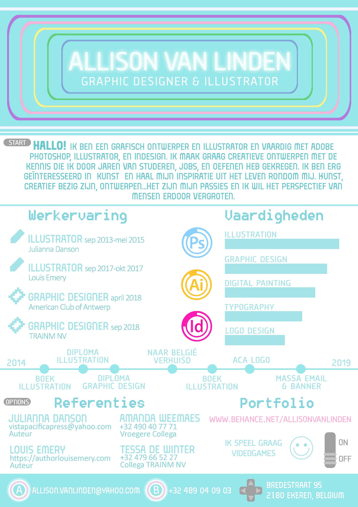

# VCard
https://lisonallie.github.io/VCard/

#### Objective
Here the objective was to create a VCard which is a short summary of your skills. It's like a resumé but with less words. This was an exercise in positioning using CSS and using elements to create different styles like gradients.

#### Purpose
For my VCard I decided to create a badge that represented my personality and flair along with my current skills.

#### What it has
It has links to my Behance, GitHub, Facebook, and Instagram accounts that are connected with art and coding.

#### Style explained
I placed the elements on the badge in this way because my CV is retro videogame-themed and I wanted to stick with the theme. Therefore you have the directional button, and 4 other buttons to my social medias. The colors are directly in line with how my CV looks:

